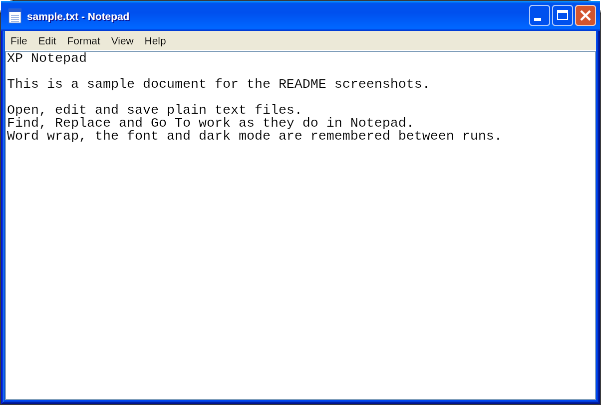
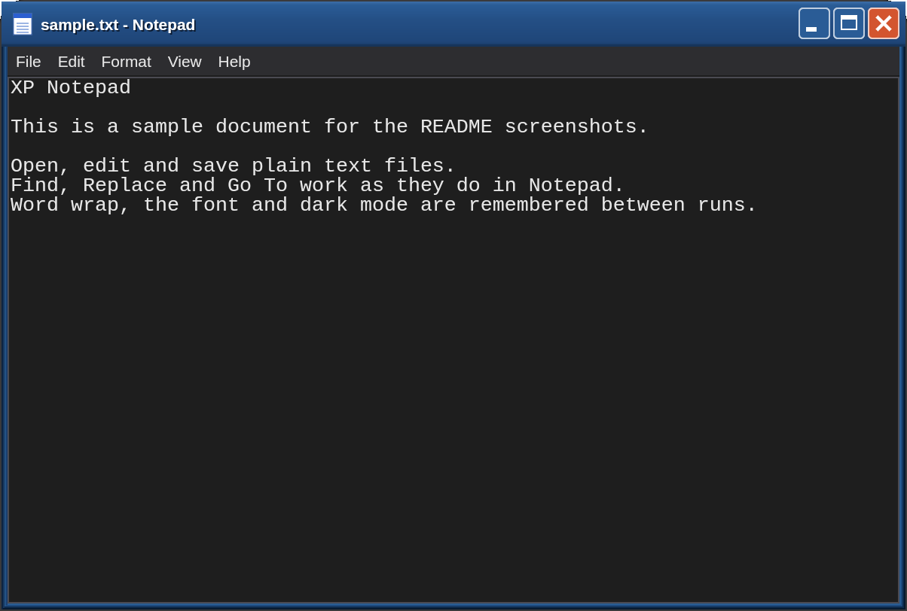

# XP Notepad (Flutter)

An unofficial recreation of Windows XP Notepad (Luna, blue), written entirely in Flutter.
Every control is drawn in Flutter: there is no WebView, no HTML or CSS, and no code of our
own in the native runners. The window, menus, dialogs and status bar are Dart widgets.

**Status.** Version 0.1.0+1, audited on 2026-10-07. Verified at runtime on Linux
(aarch64, Flutter 3.47.6). The Windows build and runtime have not been verified. The audit
found 28 defects. Eight of them (F-01 to F-05, F-13, F-21 and F-22) were fixed the same day.
The rest are open and are listed below; the handbook has the full evidence.

## Screenshots

Light mode:



Dark mode:



Both were captured on Linux from the release build, with a sample text file and a separate
settings folder.

## Downloads

The [v0.1.0 pre-release](https://github.com/goshitsarch-eng/notepad/releases/tag/v0.1.0) contains
a Flatpak bundle for arm64 (64-bit ARM) Linux, and `SHA256SUMS.txt`. Install the bundle with
`flatpak install --user xp-notepad-0.1.0-arm64.flatpak`. Flatpak refuses a second copy of the app, so
remove a system-wide copy first. Close the app before you install or uninstall it.

The x64 Flatpak, the Linux tarballs and the Windows installers are not published yet, so build those
from source. The release workflow is set up to build them. The files are not code-signed, so Windows
may show a SmartScreen warning.

## Continuous integration

`.github/workflows/ci.yml` runs `flutter analyze` and `flutter test` on every push to `main` and on
every pull request. `.github/workflows/release.yml` builds the downloads above when a version tag is
pushed. It can also be run by hand, which builds the same files without creating a release. No
workflow run has completed yet.

## Handbook

Open **`docs/handbook/index.html`** in a browser. It works straight from disk: no server, no
internet connection, no CDN and no analytics. It holds the user manual, getting started
notes, architecture, development and build notes, troubleshooting, the audit findings with
file and line evidence, and the coverage record with the verification log.

## Run

Desktop only. Install Flutter's desktop prerequisites for your OS (on Linux, the packages in
Flutter's Linux setup guide, including the GTK 3 development headers), then:

```sh
flutter pub get
flutter run -d linux
```

A file can be passed on the command line: `flutter run -d linux -- notes.txt`.
`flutter run -d windows` is not verified.

## Build

```sh
flutter build linux --release
```

The app is in `build/linux/<arch>/release/bundle/`. Keep the whole bundle directory
together. A clean build (no `build/` or `.dart_tool/`) was verified in a copy of the project.

## Test

```sh
flutter analyze
flutter test
```

On Linux, after the fixes, `flutter analyze` reports no issues and `flutter test` passes all 137
tests: the 116 from the audit and 21 regression tests added with the fixes. The regression tests
are in `test/ui/findings_regression_test.dart` and `test/data/document_repository_test.dart`.

The golden tests use 16 images in `test/ui/goldens/`. The 13 in `test/ui/notepad_golden_test.dart`
are skipped when the Liberation fonts are missing. The 3 dark-mode images in
`test/ui/dark_mode_and_help_test.dart` are not skipped. Regenerate goldens with
`flutter test --update-goldens` only after an intended visual change, and review the images.

## What it does

- **Window.** Caption with minimize, maximize and close buttons; drag the caption to move;
  resize from any edge or corner. The content cannot be smaller than 400 × 240. The title
  follows the document: `notes.txt - Notepad`, or `Untitled - Notepad`.
- **Menus.** File, Edit, Format, View and Help, in XP's order, with shortcuts, Alt
  mnemonics and keyboard navigation.
- **Editing.** Undo, cut, copy, paste, delete, select all, Find, Find Next, Replace,
  Replace All, Go To, and Time/Date (`3:31 PM 10/7/2026`). Tab inserts a tab character.
- **Files.** Open and Save As in an XP-style dialog. ANSI (Windows-1252), Unicode (UTF-16 LE),
  Unicode big endian and UTF-8, with byte order marks where XP writes them and CRLF line endings
  on disk. Saving text that ANSI cannot hold asks first.
- **Printing.** Page Setup (header, footer, margins in inches), then Print, which lays the
  text out as a PDF and opens the platform print dialog.
- **Remembered between runs.** Word wrap, status bar, dark mode, font, page setup, the normal
  window size and the last folder.

The handbook describes each feature with its keyboard shortcut, the verification status and
the limits.

## Settings

Settings are JSON. On Linux they are in `$XDG_CONFIG_HOME/xp_notepad/settings.json`, or
`~/.config/xp_notepad/settings.json` when `XDG_CONFIG_HOME` is unset. On Windows they are in
`%APPDATA%\xp_notepad\settings.json` (not verified). A damaged value falls back to its default.
An empty `XDG_CONFIG_HOME` writes the file into the working directory (finding F-10). To reset
the settings, close the app and delete the file.

## Known issues

The full list, with evidence, reproduction steps and recommendations, is in the handbook's
[audit findings](docs/handbook/index.html#findings). The eight fixed findings (four High, four
Medium) and the open Medium findings are below. The Low and Info findings are only in the handbook.

- **Fixed in this revision.** A typed Font size is applied by OK (F-01). The Font dialog and
  the Find box take keyboard focus, so typing no longer edits the document behind them
  (F-02, F-03). Typed characters are kept after New or Open (F-04). Text typed while a large
  file loads is kept, and a save prompt follows the load (F-05). Saves replace the file through
  a temporary file, keep its permissions and follow symbolic links (F-13). The Linux application
  ID is `com.goshapps.Notepad` (F-21), and the project is licensed under GPL-3.0 with a LICENSE
  file (F-22). F-01 to F-05 and F-13 have regression tests and runtime checks on the fixed build.
- **Open, Medium.** Page Setup ignores Enter (F-06). At the minimum window size the Edit menu is
  cut off (F-07). The interface has no accessibility semantics (F-15).

## Architecture

Organised as the Flutter app architecture guide recommends: UI layer (widgets plus view
model), data layer (repositories and services), and a small domain layer for pure text logic.

```
lib/
  main.dart                       window setup, then runApp
  app.dart                        providers (provider package) and WidgetsApp root
  config/app_dependencies.dart    the object graph; tests build it with fakes
  domain/                         pure Dart: settings models, text search, metrics, Time/Date
  data/
    encoding/text_codec.dart      ANSI, UTF-16, UTF-8 and BOM detection and encoding
    repositories/                 documents and settings (abstract, then implementation)
    services/                     file listing, printing (pdf), window control
  ui/
    theme/                        Luna palette, gradients, metrics and text styles
    core/                         XP widgets: frame, caption, menus, buttons, fields, scrollbars
    notepad/
      notepad_view_model.dart     state and commands; no widget code
      notepad_screen.dart         window layout, keyboard and focus
      notepad_menus.dart          menu definitions, bound to the view model
      editor/                     the edit control (EditableText) with XP scrolling
      dialogs/                    Find, Go To, Font, Page Setup, Help, About, Open/Save, messages
  utils/                          Result and Command (async action state)
docs/handbook/                    the HTML handbook (index.html, assets/, screenshots/)
```

Immutable models (`NotepadSettings`, `EditorFont`, `PageSetup`) and `Result` values flow
from repositories through the view model. Files over 512 KB are decoded in a background
isolate, and documents over 512K characters are encoded in one when saved. The lists are
built lazily. Painters repaint only when their inputs change.

The native runners in `linux/` and `windows/` are generated from Flutter's template. The
Linux runner files match the template. The Linux CMake file differs from it only in the
application ID (`com.goshapps.Notepad`, finding F-21, fixed) and in a conditional block the template omits for this project.

## Dependencies

- `provider` 6.1.5+1: dependency injection, as the architecture guide suggests.
- `window_manager` 0.5.2: the borderless window and the drawn caption. Flutter has no pure-Dart
  API for removing the OS title bar, so this is the one windowing plugin.
- `printing` 5.15.1 and `pdf` 3.13.1: printing. `pdf` is pure Dart; `printing` calls the platform dialog.
- `path` 1.9.1: file path handling.

## Known differences from stock XP Notepad

- **Dialogs are drawn inside the window**, not as separate windows. They are modal, except
  Find and Replace, which are modeless.
- **Fonts.** Tahoma, Trebuchet MS and Lucida Console are used where installed. Elsewhere
  metric-compatible Liberation fonts stand in, and a family that is not installed falls back to
  the default sans font. Glyph shapes differ on Linux, and characters the font lacks show as boxes.
- **Tabs.** A tab is drawn about one space wide in the editor, and four spaces when printed.
- **Open and Save As** have no "Places" bar, and the file list is built by the app.
- **Help Topics** lists the keyboard shortcuts in a dialog. XP opens its help file.
- **Double-click on Linux.** The Flutter Linux embedder is reported to drop the second press of a
  rapid double click, so double-clicking the caption does not maximize the window. This claim was not
  verified in the audit. The caption's double-click detection is written for platforms that deliver the second press.

The author's notes on fidelity below were not re-checked in the audit, except where the
handbook says so.

## Fidelity

The Luna colours, frame bands, caption gradient, 19px menu bar, 17px scrollbars and 13px
editor line pitch come from the Luna theme and the measured reference used by the earlier
clone. Menu and most dialog wording and the default settings (word wrap on, Lucida Console
10pt) are taken from Wine's Notepad, which reimplements Windows Notepad. The Page Setup
margins (0.75 in left and right, 1 in top and bottom), the save-changes prompt, the
"Cannot find" message and the underline-on-Alt default are from memory of XP, so check them
against a real XP install. No side-by-side screenshot comparison was made.

## Licence

This project is an unofficial recreation and is not affiliated with Microsoft. The XP
look is reproduced from measurements and published interface details. No Microsoft icons,
bitmaps or branding are used.

The project's own code is licensed under the GNU General Public License, version 3. The full
text is in the `LICENSE` file (finding F-22, fixed). Dependencies keep their own licences.
